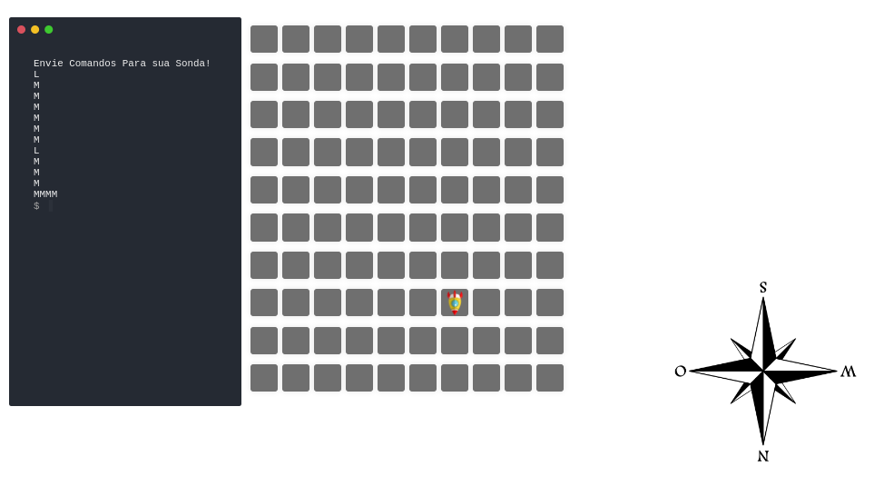

# Robo Em Marte Pro

Desafio técnico baseado no problema do robo em marte.
(robot on mars , robot simulator)

### Como rodar

- Acessar [backend](/sonda-back/) e rodar a aplicação via `yarn dev`
- Acessar [frontend](/sonda-front) e rodar aplicação via `yarn dev`

### Diferenciais Pro 
- Adicionado interface interativa.
- Adicionado web-socket para simular muitos rovers, basta abrir novas janelas.
- A um arquivo de log.txt na raiz do backend.

@by matheuscamarques